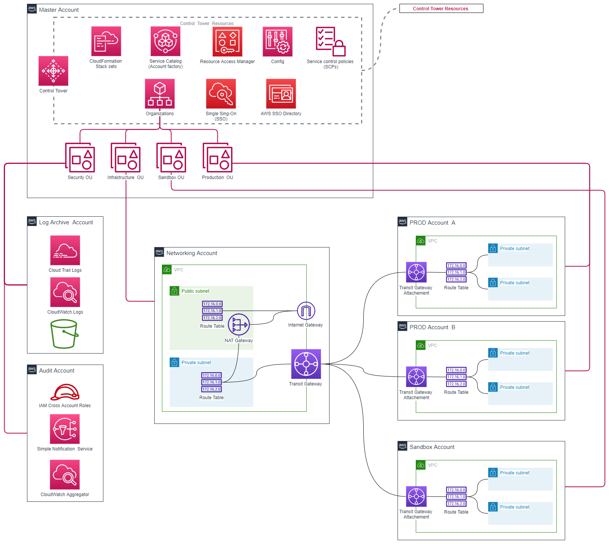
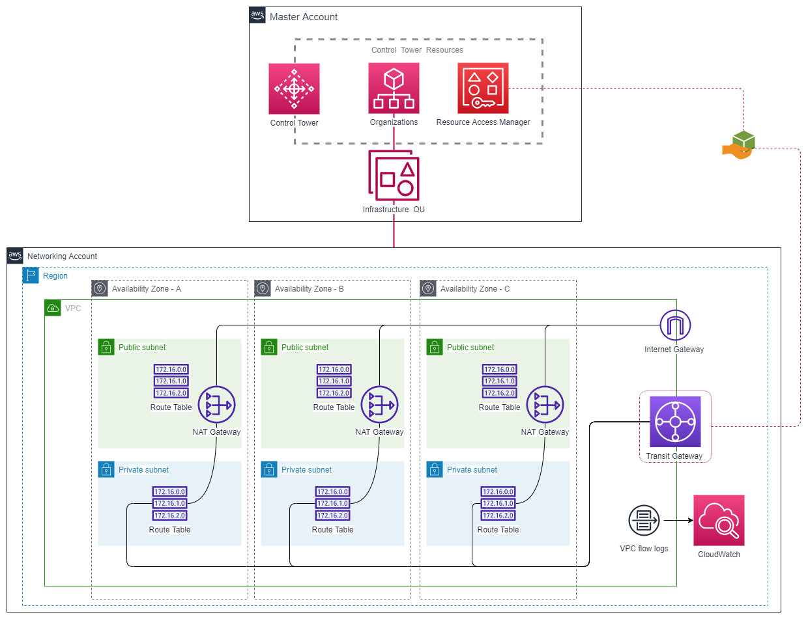

# Networking Account Deployment.

This CloudFormation template is intended for use in a Control Tower scenario where a "Networking Account" is provisioned under  an infrastructure OU to be used as a central connection point leveraging Transit Gateway.

#### Diagram of the complete solution:



### Resources deployed by this manifest:
- 3 Public subnet (AZ A to C)
- 3 Private subnet (AZ A to C)
- Internet Gateway.
- 3 NAT Gateways (AZ A to C) .
- 1 Public Route table.
- 3 Private Route tables (One per subnet).
- VPC flow logs IAM Role and Policy
- VPC flow logs CloudWatch log group.
- Transit Gateway.
- Transit Gateway Resource Access Manager Share.

### Deployment diagram:



## Deployment How-To via AWS Console:

Follow the official AWS steps: 
- [DEPLOY INFRASTRUCTURE USING A CLOUDFORMATION STACK](https://www.wellarchitectedlabs.com/reliability/200_labs/200_deploy_and_update_cloudformation/1_deploy_infra/)

### **Input the Project Name parameter:**
- **ProjectName:** Project Name to be used in tagging

### **Input the VPC definition parameters:**
- **VpcCidr:** VPC CIDR Block
- **PublicCidrA:** Public Subnet CIDR Block - AZ-A
- **PublicCidrB:** Public Subnet CIDR Block - AZ-B
- **PublicCidrC:** Public Subnet CIDR Block - AZ-C
- **PrivateCidrA:** Private Subnet CIDR Block - AZ-A
- **PrivateCidrB:** Private Subnet CIDR Block - AZ-B
- **PrivateCidrC:** Private Subnet CIDR Block - AZ-C 

### **Input the Transit Gateway definition parameters:**
- **AWSOrganizationId:** AWS Organization ID to share the resources with. Obtain from 'AWS Organizations -> Settings'
- **MasterAccountId:** 12-digt AWS Account ID of AWS Control Tower Master Account.

## Deployment How-To via CLI:

Perform an aws configure to specify your access key, secret key, and AWS Region:

``bash
aws configure
``

### Deploy:
```bash
aws cloudformation create-stack --stack-name NetworkingAccount-Stack --template-body file://PATH-TO/networking-account.yaml
```

### Monitoring deployment:
```bash
aws cloudformation wait stack-update-complete --stack-name NetworkingAccount-Stack
```

### Update Stack
```bash
aws cloudformation update-stack --stack-name NetworkingAccount-Stack --template-body file://PATH-TO/networking-account.yaml
```

### Delete Stack
```bash
aws cloudformation delete-stack --stack-name NetworkingAccount-Stack
```

## Author:

- [@JManzur](https://jmanzur.com.ar)

## Documentation:

- [Transit Gateway - Documentation](https://docs.aws.amazon.com/es_es/AWSCloudFormation/latest/UserGuide/aws-resource-ec2-transitgateway.html)
- [Transit Gateway Share - Documentation](https://docs.aws.amazon.com/AWSCloudFormation/latest/UserGuide/aws-resource-ram-resourceshare.html)